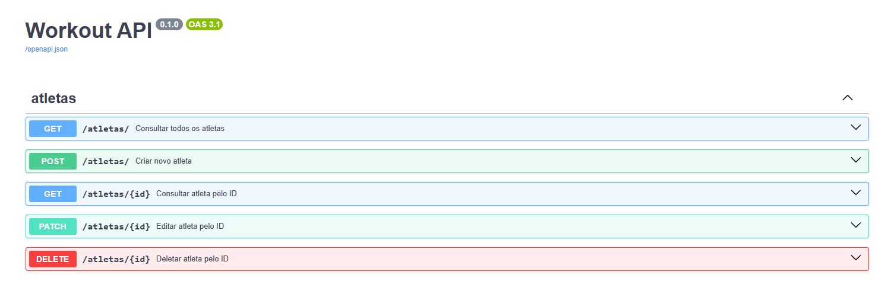
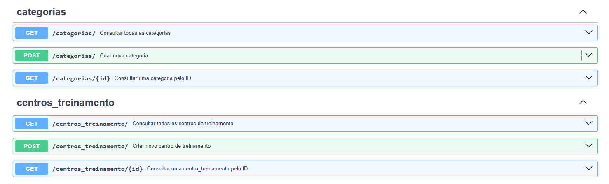
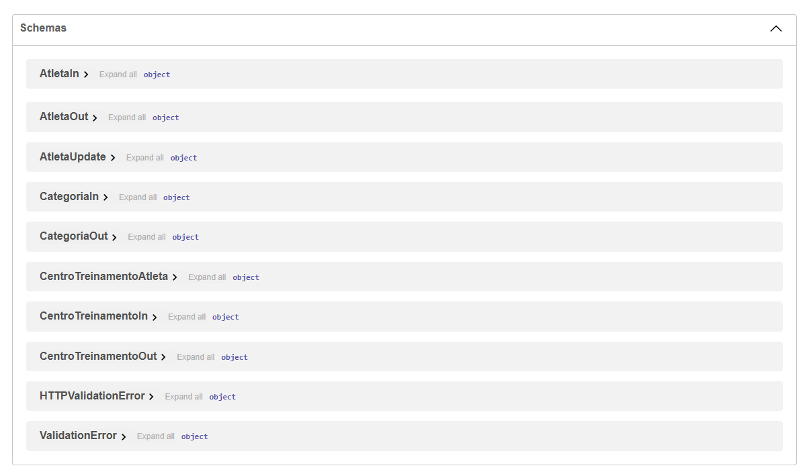

# 🏋️ Workout API

API completa para gestão de academias e atletas, desenvolvida com **FastAPI**, **Python** e **Docker**.

---

## 🚀 Tecnologias

- **FastAPI** - Framework web moderno  
- **Python 3.13** - Linguagem principal  
- **PostgreSQL** - Banco de dados  
- **SQLAlchemy** - ORM  
- **Alembic** - Migrações do banco  
- **Docker** - Containerização  
- **Pydantic** - Validação de dados  

---

## 📦 Instalação

### Pré-requisitos

- Python 3.13+
- Docker e Docker Compose
- Git

### Clone o repositório

```bash
git clone https://github.com/andre748/API-com-FastAPI-Python-e-Docker.git
cd API-com-FastAPI-Python-e-Docker/workoutapi
```

### Configure o ambiente

```bash
# Ative o ambiente virtual (Windows)
Scripts\activate
# Instale dependências
pip install -r Scripts\requirements.txt
```

### Banco de dados

```bash
# Inicie o PostgreSQL com Docker
docker-compose -f Scripts\docker-compose.yml up -d db

# Execute as migrações
cd Scripts
alembic upgrade head
```

### Execute a API

```bash
uvicorn Scripts.workout_api.main:app --reload --port 8000
```

## 📋 Endpoints
### Atletas

- GET /atletas/ - Lista todos os atletas

- GET /atletas/{id} - Busca atleta por ID

- POST /atletas/ - Cria novo atleta

- PATCH /atletas/{id} - Atualiza atleta

- DELETE /atletas/{id} - Remove atleta

📷 Exemplo visual:




### Categorias

- GET /categorias/ - Lista categorias

- GET /categorias/{id} - Busca categoria por ID

- POST /categorias/ - Cria nova categoria

### Centros de Treinamento

- GET /centros_treinamento/ - Lista centros

- GET /centros_treinamento/{id} - Busca centro por ID

- POST /centros_treinamento/ - Cria novo centro

📷 Exemplo visual:




## 🧾 Schemas

### Visualização dos schemas utilizados na API:

📷 Exemplo visual:



## 🐳 Docker
```bash
# Suba todos os serviços
docker-compose -f Scripts\docker-compose.yml up -d

# Pare os serviços  
docker-compose -f Scripts\docker-compose.yml down
```

## 📊 Estrutura do Projeto
```text
workoutapi/
├── Scripts/
│   ├── workout_api/          # Código fonte da API
│   ├── alembic/              # Migrações do banco
│   ├── docker-compose.yml    # Configuração Docker
│   └── requirements.txt      # Dependências Python
├── Lib/                      # Ambiente virtual (não versionado)
├── Include/                  # Ambiente virtual (não versionado)
└── pyvenv.cfg                # Configuração ambiente virtual
```

## 🛠️ Desenvolvimento

### Migrações de banco
```bash
cd Scripts

# Criar nova migração
alembic revision --autogenerate -m "descricao"

# Aplicar migrações  
alembic upgrade head

# Reverter migração
alembic downgrade -1
```

## 👥 Autor
**André** - [GitHub](https://github.com/andre748)
